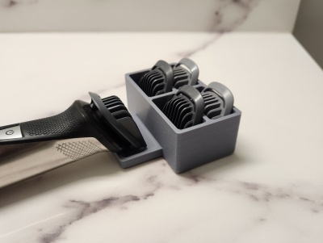
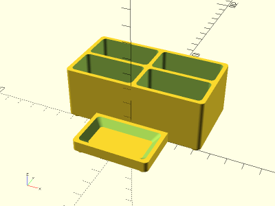

# Parametric Trimmer Tray

<table>
<tr>
<td></td>
<td></td>
</tr>
</table>

A parametric tray for a beard trimmer and its attachments. Trimmer pictured above is the Philips Norelco MG7750. Made with OpenSCAD.

**Design:** [trimmer_tray.scad](trimmer_tray.scad)

**STL:** [trimmer_tray.stl](stl/trimmer_tray.stl)

**Recommended Print Settings:** PLA+, 0.20mm layer height, default infill, supports on build plate if riser pegs are enabled

**Thingiverse:** https://www.thingiverse.com/thing:6085463

**License**: 
